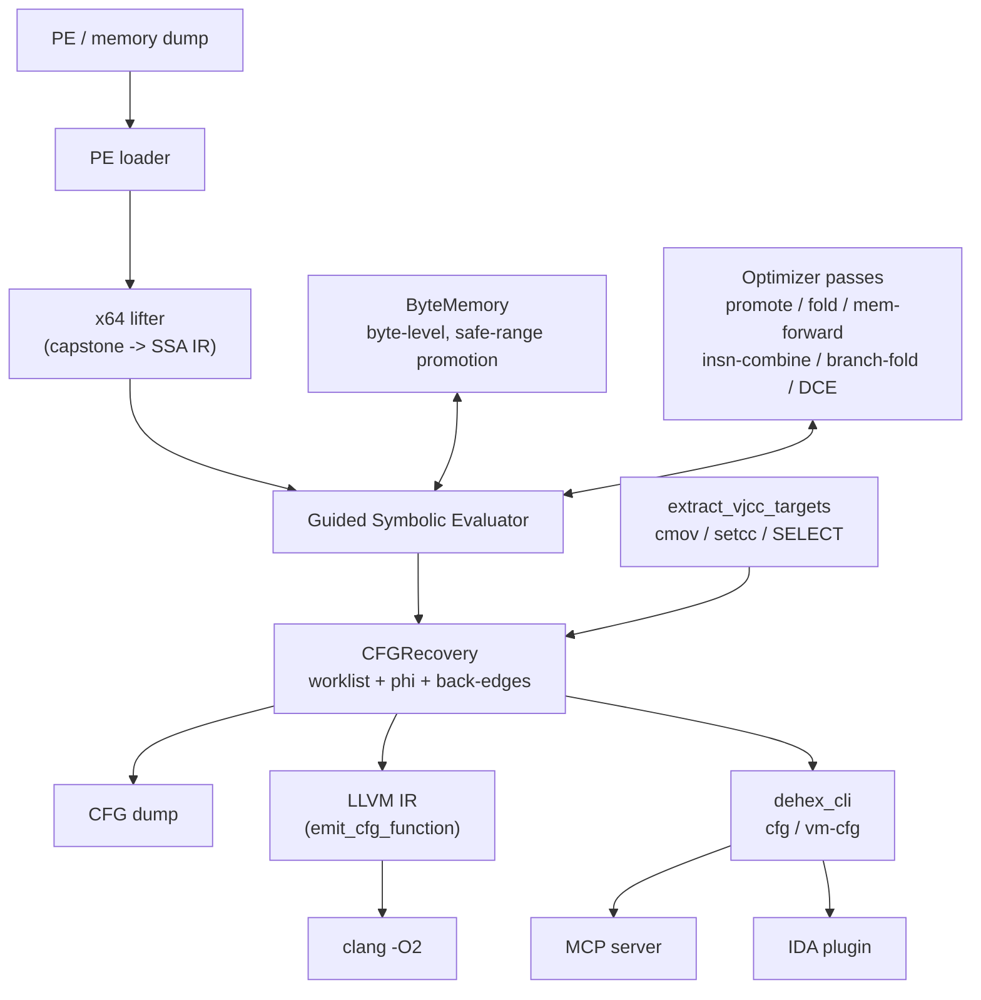
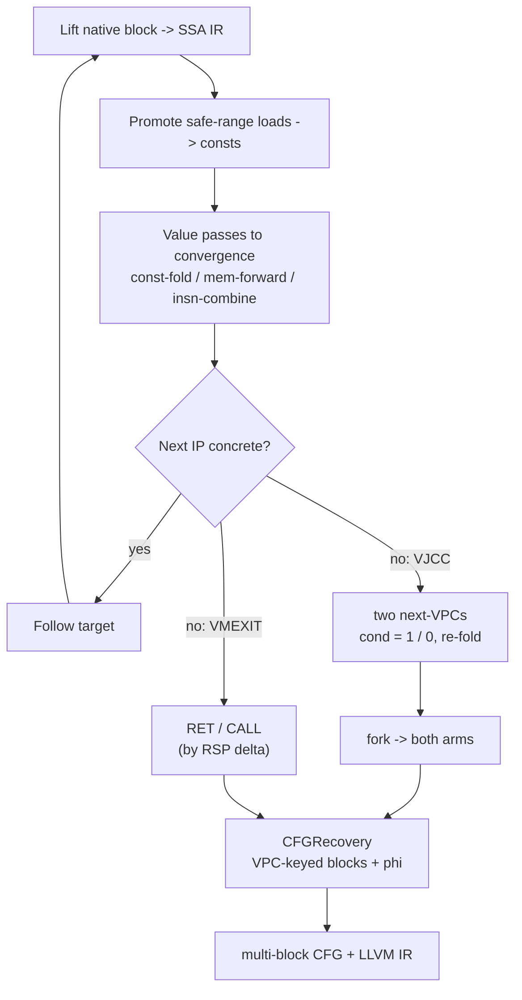

**English** | [中文](README.zh-CN.md)

# DeHendrix

Static devirtualizer / deobfuscator (C++17). Feed it a VM-protected function
(VMProtect, Themida, OLLVM, custom VMs); get back a control-flow graph and LLVM IR.

Approach: lift to SSA, then run optimizer passes that collapse the VM
interpreter — same line as SATURN and the back.engineering work. If obfuscation
is a compiler pass, so is deobfuscation.

---

## What it does

A VM protector compiles the function to bytecode and ships an interpreter to run
it. Reversing handlers one by one is pointless — they change every version.

DeHendrix ignores the handlers. It lifts the whole native blob to SSA IR and runs
constant folding, memory forwarding and dead-code elimination; the dispatch and
the stack machine fold away, leaving the original semantics. VM knowledge is used
in exactly one place: spotting virtual branches and VM exit.

---

## Architecture



The engine is one static library (`deobf`). The CLI, MCP server and IDA plugin
are thin shells over it.

---

## How it works

Lifting starts fully symbolic except RSP, which is concrete so stack accesses
fold. Per block: lift, promote bytecode reads to constants, run the value passes
to a fixpoint, read the next IP. If the IP won't go concrete, either the
optimizer needs another round or the branch has two targets (a virtual JCC).



Virtual branch targets come from substituting the VM flag with `1` and `0` and
folding — no solver. Blocks are keyed by VPC, back-edges stop loop unrolling, and
registers that disagree across predecessors get phi nodes. Full-SSA mode rewrites
each block's symbolic entry values to those phi results, closing loop def-use.

---

## Components

| Module | What |
|---|---|
| `src/ir`, `include/deobf/ir.h` | SSA IR: 28 opcodes, `Const/SymReg/SymMem/InstrRef`, `SELECT` |
| `src/lifter` | x64 lifter: capstone → IR (mov/arith/lea/push/pop/call/ret/jcc/setcc/cmov) |
| `src/passes` | passes: const promote/fold, mem-forward, insn-combine, branch-fold, DCE |
| `src/memory` | ByteMemory: byte-level load/store + safe-range constant promotion |
| `src/eval` | Guided Evaluator: lift→optimize→follow loop; VPC tracking; VMEXIT detection |
| `src/eval/segment_eval.cpp` | `recover_native_cfg`, `recover_vm_cfg`, `extract_vjcc_targets` |
| `src/ir/cfg.cpp` | CFG: blocks, edges, phi, dump |
| `src/lower` | LLVM emit: IR → `.ll` |
| `tools/cli_main.cpp` | CLI: `dehex_cli devirt / cfg / vm-cfg` |
| `bindings/mcp` | MCP server |
| `tools/ida` | IDA plugin + AI-callable API |

---

## Build

C++17, CMake ≥ 3.20, Capstone (auto-fetched).

```bash
cmake -S . -B build -DCMAKE_BUILD_TYPE=Release
cmake --build build --config Release
ctest --test-dir build
```

---

## Usage

```bash
# Native CFG (entry defaults to the PE entry point):
dehex_cli cfg --image program.exe --emit-llvm

# VM devirtualization (--safe marks the VM bytecode regions):
dehex_cli vm-cfg --image dump.bin --base 0x140000000 --entry 0x14132C758 \
    --vpc-reg r11 --safe 0x140B45000:0x14196B000 --emit-llvm

# Optimize the recovered IR:
dehex_cli cfg --image program.exe --emit-llvm --llvm-out out.ll
clang -O2 -emit-llvm -S out.ll -o out.opt.ll
```

- **MCP** — `python bindings/mcp/dehendrix_mcp.py`: `native_cfg`, `vm_devirt`,
  `vm_devirt_optimized` (runs `clang -O2`), `optimize_llvm`.
- **IDA** — `tools/ida/dehendrix_ida.py` in `plugins/`; `Ctrl-Shift-D` on a
  function. Also exposes `devirt()` / `devirt_json()` for agents.

---

## Goals

- **Now** — native CFG recovery, multi-path VM CFG (VMProtect-style, cmov/setcc
  VJCCs), and full-SSA on the generic path. All tested.
- **Next** — Themida's VM (rbp-VPC), full-SSA on the VM path.
- **Aim** — output that isn't just analyzable but reinsertable: rebuilt functions
  that still run.

---

## References

- back.engineering — [Static Devirtualization of Themida](https://back.engineering/blog/09/05/2026/)
- SATURN — [arXiv:1909.01752](https://arxiv.org/pdf/1909.01752)
- Jonathan Salwan — [VMProtect-devirtualization](https://github.com/JonathanSalwan/VMProtect-devirtualization)
- eversinc33 — [LLVM devirtualizer](https://eversinc33.com/2026/05/07/llvm-devirtualizer)
- Thalium — [LLVM-powered devirtualization](https://blog.thalium.re/posts/llvm-powered-devirtualization/)

## License

MIT.
