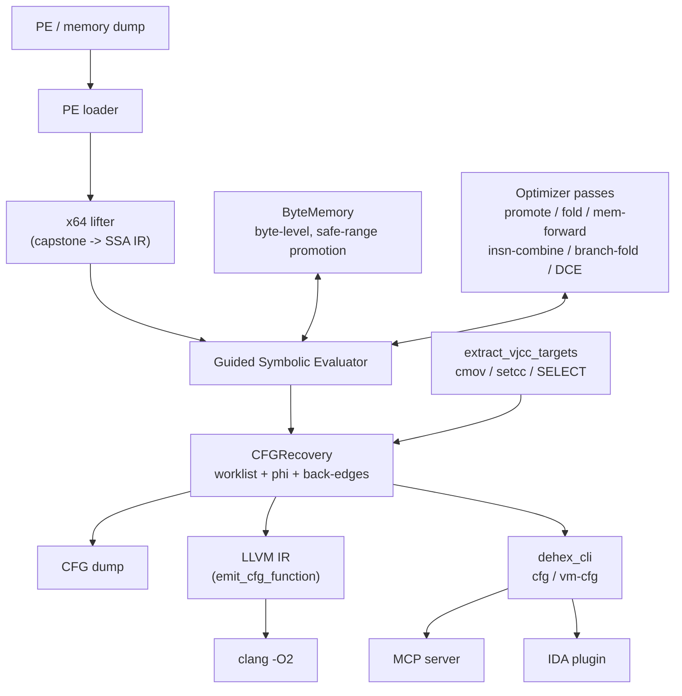
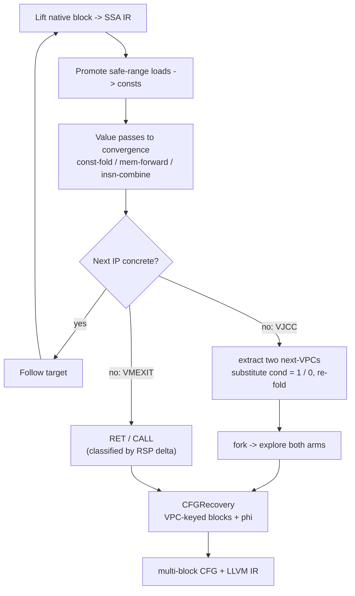

**English** | [中文](README.zh-CN.md)

# DeHendrix

**Static binary devirtualization & deobfuscation in C++17.**
Give it a VM-protected (VMProtect / Themida / OLLVM / custom-VM) function and it
hands back a clean control-flow graph and LLVM IR you can actually read.

> Methodology: Guided Symbolic Evaluation (back.engineering) + LLVM-based
> deobfuscation (SATURN). The guiding idea is simple — **obfuscation is a
> compiler transform, so deobfuscation is a compiler optimization.**

---

## What it does

A virtualizing protector turns a function into a bytecode program plus an
interpreter (dispatcher + handlers). Reading the handlers by hand does not
scale: every version bump reshuffles the opcode tables and dispatch logic.
DeHendrix takes the opposite route — it lifts the native code to SSA IR and lets
a small set of optimization passes *collapse the interpreter*, exactly the way a
compiler would fold away dead scaffolding. Almost no VM-specific knowledge is
needed; the only place it shows up is control flow (virtual branches + VM exit).

---

## Architecture



The core engine is a single static library (`deobf`). Everything else — the CLI,
the MCP server, the IDA plugin — is a thin shell over it.

---

## How it works

Lifting starts with every register and flag symbolic, except the stack pointer,
which is given a concrete value (so stack accesses fold for free). The engine
lifts a block, promotes loads from VM-bytecode regions to constants, runs the
value passes to a fixed point, and reads off the next instruction pointer. When
the next IP cannot be made concrete, one of two things is true: the optimizer
has not run far enough, or the branch genuinely has two targets (a virtual JCC).



For virtual branches the two next-VPCs are recovered generically: the VPC is a
(usually branchless) function of the VM flag, so substituting the condition with
`1` and `0` and constant-folding yields both targets — no SMT solver needed.
Blocks are keyed by VPC value, back-edges are detected so loops are not unrolled,
and registers that disagree across predecessors get phi nodes. In full-SSA mode
each block is evaluated with symbolic entry values that are rewritten to phi
results, closing loop def-use chains.

---

## Components

| Module | What |
|---|---|
| `src/ir`, `include/deobf/ir.h` | SSA IR: 28 opcodes, `Const/SymReg/SymMem/InstrRef` values, `SELECT` |
| `src/lifter` | x64 lifter: capstone → IR (mov/arith/lea/push/pop/call/ret/jcc/setcc/cmov/…) |
| `src/passes` | optimizer: const promote/fold, mem-forward, insn-combine, branch-fold, DCE |
| `src/memory` | ByteMemory: byte-level load/store tracking + safe-range constant promotion |
| `src/eval` | Guided Evaluator: the lift→optimize→follow loop; VPC tracking; VMEXIT detection |
| `src/eval/segment_eval.cpp` | CFG recovery: `recover_native_cfg`, `recover_vm_cfg`, `extract_vjcc_targets` |
| `src/ir/cfg.cpp` | CFG: basic blocks, edges, phi, multi-block dump |
| `src/lower` | LLVM emit: IR → `.ll` (single function and multi-block) |
| `tools/cli_main.cpp` | CLI: `dehex_cli devirt / cfg / vm-cfg` |
| `bindings/mcp` | MCP server: exposes the engine to AI agents / automation |
| `tools/ida` | IDA plugin: devirt the function under the cursor; AI-callable API |

---

## Build

Needs a C++17 compiler, CMake ≥ 3.20, and Capstone (auto-fetched if not found).

```bash
cmake -S . -B build -DCMAKE_BUILD_TYPE=Release
cmake --build build --config Release
ctest --test-dir build            # or run the test_* executables directly
```

---

## Usage

```bash
# Native multi-block CFG of a function (entry defaults to the PE entry point):
dehex_cli cfg --image program.exe --emit-llvm

# Multi-path VM devirtualization (mark the VM bytecode regions as "safe"):
dehex_cli vm-cfg --image dump.bin --base 0x140000000 --entry 0x14132C758 \
    --vpc-reg r11 --safe 0x140B45000:0x14196B000 --emit-llvm

# Push the recovered IR through the optimizer (collapses residual scaffolding):
dehex_cli cfg --image program.exe --emit-llvm --llvm-out out.ll
clang -O2 -emit-llvm -S out.ll -o out.opt.ll
```

- **MCP** — `python bindings/mcp/dehendrix_mcp.py` exposes `native_cfg`,
  `vm_devirt`, `vm_devirt_optimized` (runs `clang -O2`), and `optimize_llvm`.
- **IDA** — drop `tools/ida/dehendrix_ida.py` into `plugins/`; `Ctrl-Shift-D`
  devirts the function under the cursor. It also exposes a non-interactive
  `devirt()` / `devirt_json()` API for agents.

---

## Status & limits

The goal is **analyzable** output — a readable CFG + LLVM IR for an analyst or
for IDA/Ghidra — not (yet) a 1:1 reinsertable binary. Recovering native CFGs and
multi-path VM CFGs (VMProtect-style, cmov/setcc VJCCs) works and is covered by
tests. Known gaps: Themida's VM (rbp-based VPC, different VJCC handler) is not
wired in yet; full-SSA rewrite is wired in the generic recovery path but not yet
the VM path; reinserting clean native code would need a custom backend (LLVM is
the wrong tool for that last mile — see the back.engineering writeup).

---

## References

- back.engineering — [Static Devirtualization of Themida](https://back.engineering/blog/09/05/2026/)
- SATURN — [LLVM-based deobfuscation (arXiv:1909.01752)](https://arxiv.org/pdf/1909.01752)
- Jonathan Salwan — [VMProtect-devirtualization](https://github.com/JonathanSalwan/VMProtect-devirtualization)
- eversinc33 — [Naive LLVM-based devirtualizer](https://eversinc33.com/2026/05/07/llvm-devirtualizer)
- Thalium — [LLVM-powered devirtualization](https://blog.thalium.re/posts/llvm-powered-devirtualization/)

## License

MIT.
