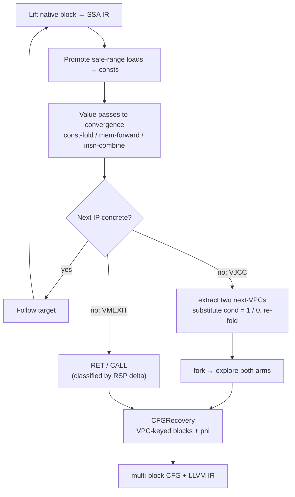

<!-- LANG: English first, 中文在每节后面 -->

# DeHendrix

**Static binary devirtualization & deobfuscation in C++17.**
Give it a VM-protected (VMProtect / Themida / OLLVM / custom-VM) function and it
hands back a clean control-flow graph and LLVM IR you can actually read.

**C++17 静态二进制去虚拟化 / 去混淆引擎。**
给它一个被 VM 保护（VMProtect / Themida / OLLVM / 自研 VM）的函数，它还你一张
干净的控制流图和可读的 LLVM IR。

> Methodology: Guided Symbolic Evaluation (back.engineering) + LLVM-based
> deobfuscation (SATURN). The guiding idea is simple — **obfuscation is a
> compiler transform, so deobfuscation is a compiler optimization.**
>
> 方法论：Guided Symbolic Evaluation（back.engineering）+ 基于 LLVM 的去混淆
> （SATURN）。核心思想很简单——**混淆是编译器变换，去混淆就是编译器优化。**

---

## What it does / 它解决什么

A virtualizing protector turns a function into a bytecode program plus an
interpreter (dispatcher + handlers). Reading the handlers by hand does not
scale: every version bump reshuffles the opcode tables and dispatch logic.
DeHendrix takes the opposite route — it lifts the native code to SSA IR and lets
a small set of optimization passes *collapse the interpreter*, exactly the way a
compiler would fold away dead scaffolding. Almost no VM-specific knowledge is
needed; the only place it shows up is control flow (virtual branches + VM exit).

虚拟化保护器把一个函数变成「字节码 + 解释器（dispatcher + handlers）」。手工逐个
逆 handler 不可持续：保护器每升一版就打乱操作码表和分发逻辑。DeHendrix 反着来——
把原生代码提升成 SSA IR，让一小组优化 pass **把解释器自己折叠掉**，就像编译器折掉
死脚手架一样。几乎不需要 VM 专属知识，唯一需要的地方是控制流（虚拟分支 + VM 退出）。

---

## Architecture / 架构


The core engine is a single static library (`deobf`). Everything else — the CLI,
the MCP server, the IDA plugin — is a thin shell over it.

核心引擎是一个静态库（`deobf`）。其余的一切——CLI、MCP server、IDA 插件——都只是
它薄薄的一层外壳。

---

## How it works / 原理

Lifting starts with every register and flag symbolic, except the stack pointer,
which is given a concrete value (so stack accesses fold for free). The engine
lifts a block, promotes loads from VM-bytecode regions to constants, runs the
value passes to a fixed point, and reads off the next instruction pointer. When
the next IP cannot be made concrete, one of two things is true: the optimizer
has not run far enough, or the branch genuinely has two targets (a virtual JCC).

提升时所有寄存器和标志位都是符号的，**只有栈指针给具体值**（这样栈访问能免费折叠）。
引擎提升一个块、把 VM 字节码区的 load 提升成常量、把值传播 pass 跑到不动点、读出下一个
指令指针。当下一个 IP 无法具体化时只有两种可能：优化还没跑够，或这个分支真有两个目标
（虚拟条件跳转 VJCC）。



For virtual branches the two next-VPCs are recovered generically: the VPC is a
(usually branchless) function of the VM flag, so substituting the condition with
`1` and `0` and constant-folding yields both targets — no SMT solver needed.
Blocks are keyed by VPC value, back-edges are detected so loops are not unrolled,
and registers that disagree across predecessors get phi nodes.

虚拟分支的两个 next-VPC 是通用恢复的：VPC 通常是 VM 标志位的（多为无分支）函数，
所以把条件代入 `1` 和 `0` 再常量折叠就能得到两个目标——不需要 SMT 求解器。块以 VPC
值为键，检测回边以免把循环展开，前驱之间取值不一致的寄存器生成 phi 节点。

---

## Components / 模块

| Module | 模块 | What |
|---|---|---|
| `src/ir`, `include/deobf/ir.h` | SSA IR | 28 opcodes, `Const/SymReg/SymMem/InstrRef` values, `SELECT` |
| `src/lifter` | x64 lifter | capstone → IR (mov/arith/lea/push/pop/call/ret/jcc/setcc/cmov/…) |
| `src/passes` | optimizer | const promote/fold, mem-forward, insn-combine, branch-fold, DCE |
| `src/memory` | ByteMemory | byte-level load/store tracking + safe-range constant promotion |
| `src/eval` | Guided Evaluator | the lift→optimize→follow loop; VPC tracking; VMEXIT detection |
| `src/eval/segment_eval.cpp` | CFG recovery | `recover_native_cfg`, `recover_vm_cfg`, `extract_vjcc_targets` |
| `src/ir/cfg.cpp` | CFG | basic blocks, edges, phi, multi-block dump |
| `src/lower` | LLVM emit | IR → `.ll` (single function and multi-block) |
| `tools/cli_main.cpp` | CLI | `dehex_cli devirt / cfg / vm-cfg` |
| `bindings/mcp` | MCP server | exposes the engine to AI agents / automation |
| `tools/ida` | IDA plugin | devirt the function under the cursor; AI-callable API |

---

## Build / 构建

Needs a C++17 compiler, CMake ≥ 3.20, and Capstone (auto-fetched if not found).

```bash
cmake -S . -B build -DCMAKE_BUILD_TYPE=Release
cmake --build build --config Release
ctest --test-dir build            # or run the test_* executables directly
```

需要 C++17 编译器、CMake ≥ 3.20、Capstone（找不到会自动拉取）。命令同上。

---

## Usage / 用法

```bash
# Native multi-block CFG of a function (entry defaults to the PE entry point):
dehex_cli cfg --image program.exe --emit-llvm

# Multi-path VM devirtualization (mark the VM bytecode regions as "safe"):
dehex_cli vm-cfg --image dump.bin --base 0x140000000 --entry 0x14132C758 \
    --vpc-reg r11 --safe 0x140B45000:0x14196B000 --emit-llvm

# Push the recovered IR through the optimizer (collapses residual scaffolding):
dehex_cli cfg --image program.exe --emit-llvm --llvm-out out.ll
clang -O2 -emit-llvm -S out.ll -o out.opt.ll
```

**MCP** — `python bindings/mcp/dehendrix_mcp.py` exposes `native_cfg`,
`vm_devirt`, `vm_devirt_optimized` (runs `clang -O2`), and `optimize_llvm`.
**IDA** — drop `tools/ida/dehendrix_ida.py` into `plugins/`; `Ctrl-Shift-D`
devirts the function under the cursor. It also exposes a non-interactive
`devirt()` / `devirt_json()` API for agents.

**MCP**：`python bindings/mcp/dehendrix_mcp.py` 暴露 `native_cfg` / `vm_devirt` /
`vm_devirt_optimized`（内部跑 `clang -O2`）/ `optimize_llvm`。
**IDA**：把 `tools/ida/dehendrix_ida.py` 放进 `plugins/`，`Ctrl-Shift-D` 去虚拟化
光标处的函数；另有非交互的 `devirt()` / `devirt_json()` 供 agent 调用。

---

## Status & limits / 现状与局限

The goal is **analyzable** output — a readable CFG + LLVM IR for an analyst or
for IDA/Ghidra — not (yet) a 1:1 reinsertable binary. Recovering native CFGs and
multi-path VM CFGs (VMProtect-style, cmov/setcc VJCCs) works and is covered by
tests. Known gaps: Themida's VM (rbp-based VPC, different VJCC handler) is not
wired in yet; loop-header IR is not in full pruned SSA form; reinserting clean
native code would need a custom backend (LLVM is the wrong tool for that last
mile — see the back.engineering writeup).

目标是产出**可分析**的结果——给分析者或 IDA/Ghidra 用的可读 CFG + LLVM IR——而**还不是**
1:1 可回插的二进制。原生 CFG 恢复、多路径 VM CFG（VMProtect 形态、cmov/setcc 型 VJCC）
已可用且有测试覆盖。已知缺口：Themida 的 VM（rbp 型 VPC、不同的 VJCC handler）尚未接入；
循环头的块内 IR 还不是完整裁剪过的 SSA；要回插干净原生码得自研后端（LLVM 不适合这最后
一公里——见 back.engineering 的文章）。

---

## References / 方法论参考

- back.engineering — [Static Devirtualization of Themida](https://back.engineering/blog/09/05/2026/)
- SATURN — [LLVM-based deobfuscation (arXiv:1909.01752)](https://arxiv.org/pdf/1909.01752)
- Jonathan Salwan — [VMProtect-devirtualization](https://github.com/JonathanSalwan/VMProtect-devirtualization)
- eversinc33 — [Naive LLVM-based devirtualizer](https://eversinc33.com/2026/05/07/llvm-devirtualizer)
- Thalium — [LLVM-powered devirtualization](https://blog.thalium.re/posts/llvm-powered-devirtualization/)

## License / 许可

MIT.
