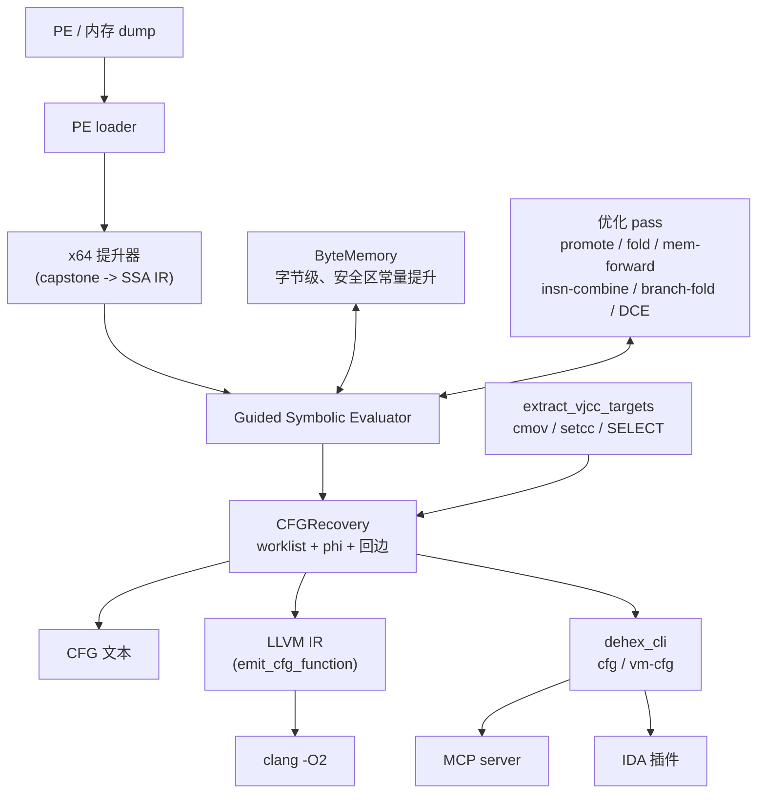
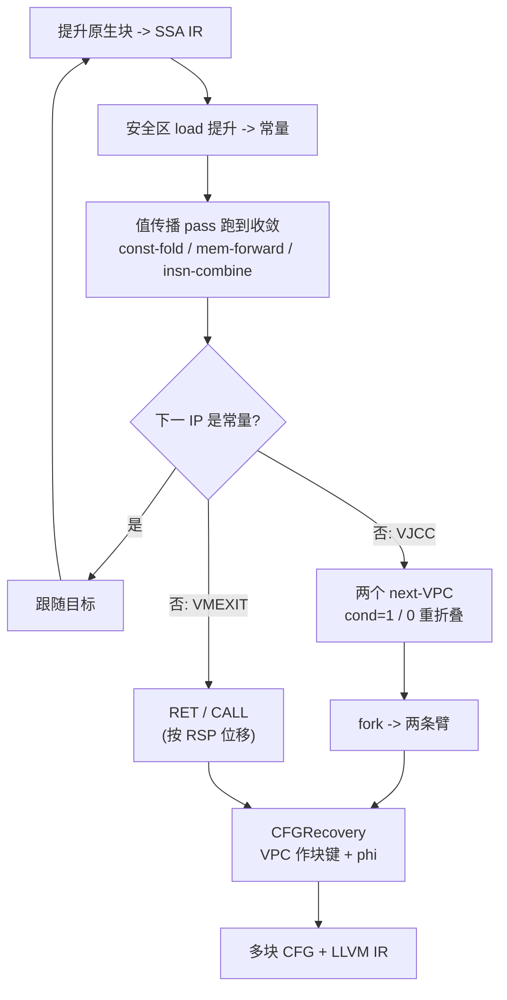

[English](README.md) | **中文**

# DeHendrix

C++17 静态去虚拟化 / 去混淆引擎。丢给它一个被 VM 保护（VMProtect / Themida /
OLLVM / 自研 VM）的函数，输出控制流图和 LLVM IR。

思路：提升成 SSA，再用优化 pass 把 VM 解释器折掉——和 SATURN、back.engineering
一条路。混淆是编译器 pass，去混淆也是。

---

## 它做什么

VM 保护把函数编译成字节码，再塞一个解释器去跑它。逐个逆 handler 没意义——换版本
就变。

DeHendrix 不碰 handler：整段原生码提升成 SSA IR，跑常量折叠、内存转发、死代码消除
几个 pass，派发和栈机器自己就化没了，剩下原函数语义。VM 知识只用在一处：认出虚拟
分支和 VM 退出。

---

## 架构



引擎是一个静态库（`deobf`）。CLI、MCP server、IDA 插件都是它的薄壳。

---

## 原理

提升时除 RSP 外全是符号；RSP 给具体值，栈访问就能折叠。每块：提升、把字节码读
提升成常量、值传播 pass 跑到不动点、读下一个 IP。IP 不肯变常量，就两种情况：优化
还要再来一轮，或这分支有两个目标（虚拟条件跳转 VJCC）。



虚拟分支的目标：把 VM 标志位代入 `1` 和 `0` 折叠就能拿到，不用求解器。块以 VPC 为
键，回边阻止循环展开，前驱取值不一致的寄存器生成 phi。完整 SSA 模式把每块的符号
入口值重写成对应 phi 结果，闭合循环 def-use。

---

## 模块

| 模块 | 作用 |
|---|---|
| `src/ir`, `include/deobf/ir.h` | SSA IR：28 操作码，`Const/SymReg/SymMem/InstrRef`，`SELECT` |
| `src/lifter` | x64 提升器：capstone → IR（mov/算术/lea/push/pop/call/ret/jcc/setcc/cmov） |
| `src/passes` | pass：常量提升/折叠、mem-forward、insn-combine、branch-fold、DCE |
| `src/memory` | ByteMemory：字节级 load/store + 安全区常量提升 |
| `src/eval` | Guided Evaluator：lift→optimize→follow 循环；VPC 跟踪；VMEXIT 检测 |
| `src/eval/segment_eval.cpp` | `recover_native_cfg`、`recover_vm_cfg`、`extract_vjcc_targets` |
| `src/ir/cfg.cpp` | CFG：块、边、phi、dump |
| `src/lower` | LLVM 导出：IR → `.ll` |
| `tools/cli_main.cpp` | CLI：`dehex_cli devirt / cfg / vm-cfg` |
| `bindings/mcp` | MCP server |
| `tools/ida` | IDA 插件 + AI 可调用接口 |

---

## 构建

C++17、CMake ≥ 3.20、Capstone（自动拉取）。

```bash
cmake -S . -B build -DCMAKE_BUILD_TYPE=Release
cmake --build build --config Release
ctest --test-dir build
```

---

## 用法

```bash
# 原生 CFG（--entry 不给时用 PE 入口）：
dehex_cli cfg --image program.exe --emit-llvm

# VM 去虚拟化（--safe 标记 VM 字节码区）：
dehex_cli vm-cfg --image dump.bin --base 0x140000000 --entry 0x14132C758 \
    --vpc-reg r11 --safe 0x140B45000:0x14196B000 --emit-llvm

# 优化恢复出的 IR：
dehex_cli cfg --image program.exe --emit-llvm --llvm-out out.ll
clang -O2 -emit-llvm -S out.ll -o out.opt.ll
```

- **MCP**：`python bindings/mcp/dehendrix_mcp.py`：`native_cfg`、`vm_devirt`、
  `vm_devirt_optimized`（跑 `clang -O2`）、`optimize_llvm`。
- **IDA**：`tools/ida/dehendrix_ida.py` 放进 `plugins/`，函数上按 `Ctrl-Shift-D`；
  另有 `devirt()` / `devirt_json()` 供 agent 调用。

---

## 目标

- **现在** —— 原生 CFG 恢复、多路径 VM CFG（VMProtect 形态、cmov/setcc VJCC）、
  通用路径的完整 SSA。均有测试。
- **下一步** —— Themida 的 VM（rbp-VPC）、VM 路径的完整 SSA。
- **终极** —— 输出不止可分析，还能回插：重建出仍可运行的函数。

---

## 方法论参考

- back.engineering — [Static Devirtualization of Themida](https://back.engineering/blog/09/05/2026/)
- SATURN — [arXiv:1909.01752](https://arxiv.org/pdf/1909.01752)
- Jonathan Salwan — [VMProtect-devirtualization](https://github.com/JonathanSalwan/VMProtect-devirtualization)
- eversinc33 — [LLVM devirtualizer](https://eversinc33.com/2026/05/07/llvm-devirtualizer)
- Thalium — [LLVM-powered devirtualization](https://blog.thalium.re/posts/llvm-powered-devirtualization/)

## 许可

MIT.
