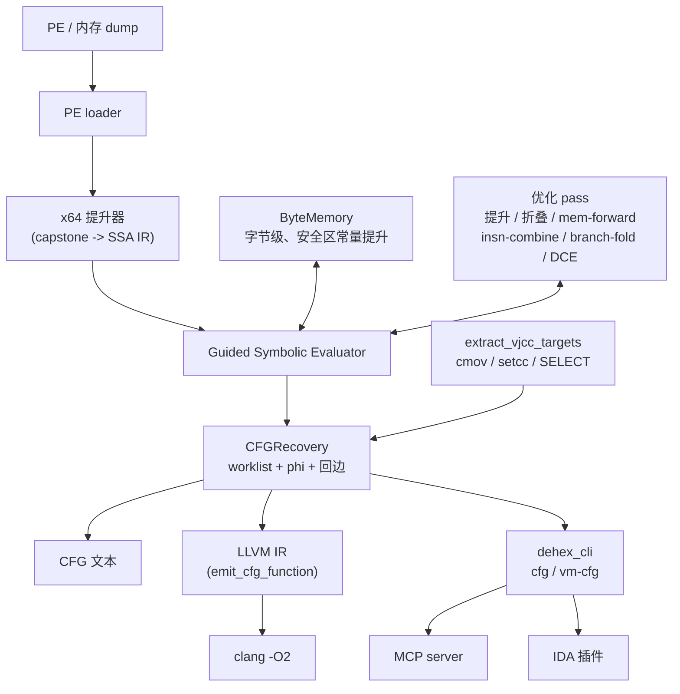
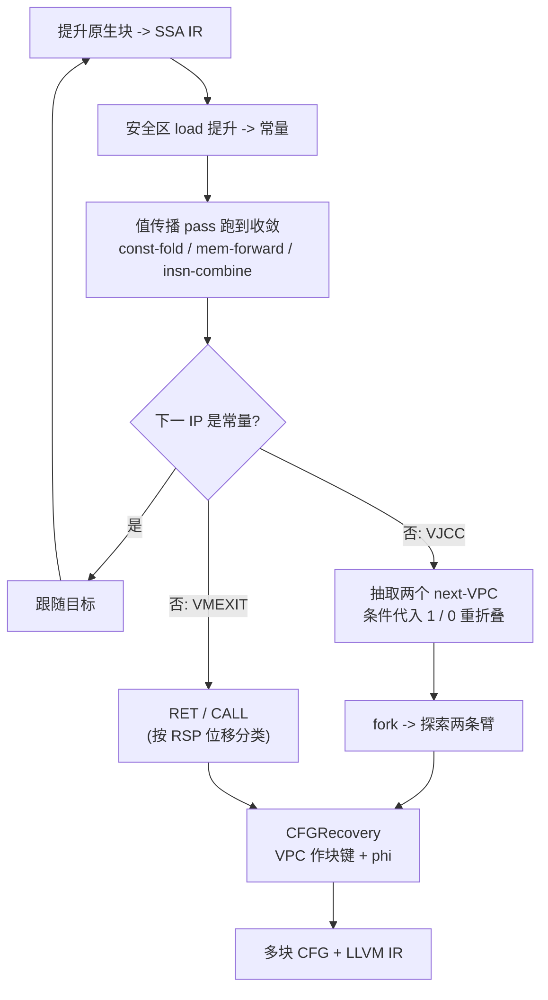

[English](README.md) | **中文**

# DeHendrix

**C++17 静态二进制去虚拟化 / 去混淆引擎。**
给它一个被 VM 保护（VMProtect / Themida / OLLVM / 自研 VM）的函数，它还你一张
干净的控制流图和可读的 LLVM IR。

> 方法论：Guided Symbolic Evaluation（back.engineering）+ 基于 LLVM 的去混淆
> （SATURN）。一句话——**如果混淆基于编译器，那么去混淆也是。**

---

## 它解决什么

虚拟化保护器把一个函数变成「字节码 + 解释器（dispatcher + handlers）」。手工逐个
逆 handler 不可持续：保护器每升一版就打乱操作码表和分发逻辑。DeHendrix 反着来——
把原生代码提升成 SSA IR，让一小组优化 pass **把解释器自己折叠掉**，就像编译器折掉
死脚手架一样。几乎不需要 VM 专属知识，唯一用到的地方是控制流（虚拟分支 + VM 退出）。

---

## 架构



核心引擎是一个静态库（`deobf`）。其余的一切——CLI、MCP server、IDA 插件——都只是
它薄薄的一层外壳。

---

## 原理

提升时所有寄存器和标志位都是符号的，**只有栈指针给具体值**（这样栈访问能免费折叠）。
引擎提升一个块、把 VM 字节码区的 load 提升成常量、把值传播 pass 跑到不动点、读出下一个
指令指针。当下一个 IP 无法具体化时只有两种可能：优化还没跑够，或这个分支真有两个目标
（虚拟条件跳转 VJCC）。



虚拟分支的两个 next-VPC 是通用恢复的：VPC 通常是 VM 标志位的（多为无分支）函数，
所以把条件代入 `1` 和 `0` 再常量折叠就能得到两个目标——不需要 SMT 求解器。块以 VPC
值为键，检测回边以免把循环展开，前驱之间取值不一致的寄存器生成 phi 节点。完整 SSA
模式下，每个块用符号入口值求值、再把它们重写成 phi 结果，闭合循环 def-use 链。

---

## 模块

| 模块 | 作用 |
|---|---|
| `src/ir`, `include/deobf/ir.h` | SSA IR：28 操作码，`Const/SymReg/SymMem/InstrRef` 四型值，`SELECT` |
| `src/lifter` | x64 提升器：capstone → IR（mov/算术/lea/push/pop/call/ret/jcc/setcc/cmov/…） |
| `src/passes` | 优化器：常量提升/折叠、mem-forward、insn-combine、branch-fold、DCE |
| `src/memory` | ByteMemory：字节级 load/store 跟踪 + 安全区常量提升 |
| `src/eval` | Guided Evaluator：lift→optimize→follow 循环；VPC 跟踪；VMEXIT 检测 |
| `src/eval/segment_eval.cpp` | CFG 恢复：`recover_native_cfg`、`recover_vm_cfg`、`extract_vjcc_targets` |
| `src/ir/cfg.cpp` | CFG：基本块、边、phi、多块 dump |
| `src/lower` | LLVM 导出：IR → `.ll`（单函数与多块） |
| `tools/cli_main.cpp` | CLI：`dehex_cli devirt / cfg / vm-cfg` |
| `bindings/mcp` | MCP server：把引擎暴露给 AI agent / 自动化 |
| `tools/ida` | IDA 插件：去虚拟化光标处函数；带 AI 可调用接口 |

---

## 构建

需要 C++17 编译器、CMake ≥ 3.20、Capstone（找不到会自动拉取）。

```bash
cmake -S . -B build -DCMAKE_BUILD_TYPE=Release
cmake --build build --config Release
ctest --test-dir build            # 或直接运行 test_* 可执行文件
```

---

## 用法

```bash
# 函数的原生多块 CFG（--entry 不给时默认用 PE 入口点）：
dehex_cli cfg --image program.exe --emit-llvm

# 多路径 VM 去虚拟化（用 --safe 标记 VM 字节码区域）：
dehex_cli vm-cfg --image dump.bin --base 0x140000000 --entry 0x14132C758 \
    --vpc-reg r11 --safe 0x140B45000:0x14196B000 --emit-llvm

# 把恢复的 IR 喂给优化器（折掉残余脚手架）：
dehex_cli cfg --image program.exe --emit-llvm --llvm-out out.ll
clang -O2 -emit-llvm -S out.ll -o out.opt.ll
```

- **MCP**：`python bindings/mcp/dehendrix_mcp.py` 暴露 `native_cfg`、`vm_devirt`、
  `vm_devirt_optimized`（内部跑 `clang -O2`）、`optimize_llvm`。
- **IDA**：把 `tools/ida/dehendrix_ida.py` 放进 `plugins/`，`Ctrl-Shift-D`
  去虚拟化光标处的函数；另有非交互的 `devirt()` / `devirt_json()` 接口供 agent 调用。

---

## 现状与局限

目标是产出**可分析**的结果——给分析者或 IDA/Ghidra 用的可读 CFG + LLVM IR——而**还不是**
1:1 可回插的二进制。原生 CFG 恢复、多路径 VM CFG（VMProtect 形态、cmov/setcc 型 VJCC）
已可用且有测试覆盖。已知缺口：Themida 的 VM（rbp 型 VPC、不同的 VJCC handler）尚未接入；
完整 SSA 重写已接在通用恢复路径、但尚未接到 VM 路径；要回插干净原生码得自研后端（LLVM
不适合这最后一公里——见 back.engineering 的文章）。

---

## 方法论参考

- back.engineering — [Static Devirtualization of Themida](https://back.engineering/blog/09/05/2026/)
- SATURN — [LLVM-based deobfuscation (arXiv:1909.01752)](https://arxiv.org/pdf/1909.01752)
- Jonathan Salwan — [VMProtect-devirtualization](https://github.com/JonathanSalwan/VMProtect-devirtualization)
- eversinc33 — [Naive LLVM-based devirtualizer](https://eversinc33.com/2026/05/07/llvm-devirtualizer)
- Thalium — [LLVM-powered devirtualization](https://blog.thalium.re/posts/llvm-powered-devirtualization/)

## 许可

MIT.
